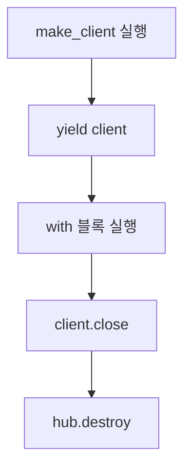

---
categories:
  - Python
tags:
  - python
  - contextmanager
  - contextlib
mermaid: true
source_item: "python contextmanager의 사용"
---
> 반복되는 `try/finally` 자원 정리 코드를 `with` 문으로 묶어보자.
---

# 개요

외부 API 클라이언트나 DB 연결처럼 사용 후 반드시 정리해야 하는 자원이 있다.

```python
client = self._make_client()

try:
    result = client.infer(...)
finally:
    client.close()
    hub.destroy()
```

이 코드는 나쁘지 않다. 오히려 자원을 정리하는 가장 명시적인 형태다. 문제는 같은 초기화와 정리 코드가 여러 곳에 반복되기 시작할 때다. 누군가는 `close()`를 빼먹고, 다른 곳에서는 예외가 발생했을 때만 정리가 되지 않는 코드가 생길 수 있다.

이럴 때 `contextlib.contextmanager`를 사용하면 자원의 생명주기를 하나의 함수에 모으고 호출부에서는 `with` 문으로 사용할 수 있다.

# context manager란?

Python에서 context manager는 `with` 블록에 들어갈 때와 빠져나올 때 실행할 동작을 정의한 객체다. 파일을 열 때 자주 사용하는 아래 코드도 같은 원리다.

```python
with open("result.txt", "w") as file:
    file.write("done")
```

블록에 들어갈 때 파일을 열고, 블록을 벗어날 때 파일을 닫는다. 본문에서 예외가 발생해도 파일 정리는 실행된다.

직접 클래스로 구현하려면 `__enter__()`와 `__exit__()` 메서드를 만들어야 한다.

```python
class ManagedClient:
    def __init__(self, make_client):
        self.make_client = make_client
        self.client = None

    def __enter__(self):
        self.client = self.make_client()
        return self.client

    def __exit__(self, exc_type, exc_value, traceback):
        self.client.close()
        return False
```

`__enter__()`의 반환값이 `as client`에 전달되고, `__exit__()`은 `with` 블록이 끝날 때 실행된다. 여기서 `False`를 반환하면 블록 안에서 발생한 예외를 처리한 척하지 않고 호출자에게 그대로 전달한다.

간단한 자원 관리 로직마다 클래스를 하나씩 만드는 것은 번거롭다. `@contextmanager`는 같은 구조를 generator 함수 하나로 표현하게 해준다.

# `@contextmanager`로 바꾸기

```python
from contextlib import contextmanager


@contextmanager
def managed_client(make_client, hub):
    client = make_client()

    try:
        yield client
    finally:
        try:
            client.close()
        finally:
            hub.destroy()
```

호출부는 다음처럼 단순해진다.

```python
with managed_client(self._make_client, hub) as client:
    result = client.infer(...)
```

실행 순서는 다음과 같다.



- `yield` 전: 자원을 준비하고 `with` 블록에 전달한다.
- `yield` 시점: 함수 실행이 잠시 멈추고 `with` 블록이 실행된다.
- `yield` 후: 블록이 정상 종료되거나 예외로 끝나면 함수 실행이 재개된다.
- `finally`: 블록의 성공 여부와 무관하게 정리 코드를 실행한다.

예제에서 `close()`와 `destroy()`를 중첩된 `finally`로 감싼 이유도 있다. 단순히 아래처럼 나열하면 `client.close()` 자체가 예외를 발생시켰을 때 `hub.destroy()`에는 도달하지 못한다.

```python
finally:
    client.close()
    hub.destroy()  # close()가 실패하면 실행되지 않는다.
```

서로 독립적인 두 정리 작업이 모두 중요하다면 각각 실행될 수 있는 구조로 만드는 편이 안전하다. 관리할 자원이 많거나 동적으로 늘어난다면 `contextlib.ExitStack`도 고려할 수 있다.

# 예외가 발생해도 정리되는지 확인하기

아래 코드는 `with` 블록 안에서 의도적으로 예외를 발생시킨다.

```python
from contextlib import contextmanager


class Client:
    def infer(self):
        print("infer")
        raise RuntimeError("inference failed")

    def close(self):
        print("client closed")


@contextmanager
def managed_client():
    client = Client()
    print("client created")

    try:
        yield client
    finally:
        client.close()


try:
    with managed_client() as client:
        client.infer()
except RuntimeError as error:
    print(f"caught: {error}")
```

실행 결과는 다음과 같다.

```text
client created
infer
client closed
caught: inference failed
```

추론 도중 예외가 발생했지만 `client.close()`가 먼저 실행된 뒤 예외가 바깥의 `except`로 전달된다. 이것이 자원 관리를 context manager에 맡기는 가장 큰 이유다.

# 주의할 점

## `yield`는 정확히 한 번이어야 한다

`@contextmanager`가 붙은 함수는 generator여야 하며 정확히 한 번 `yield`해야 한다. `yield`가 없거나 조건에 따라 실행되지 않으면 `with` 문에 진입할 수 없다. 두 번 이상 `yield`하는 함수도 context manager의 진입과 종료라는 구조에 맞지 않는다.

## 로깅한 예외를 실수로 삼키지 않기

`with` 블록에서 발생한 예외는 generator의 `yield` 위치로 다시 전달된다. 따라서 context manager 안에서 예외를 기록할 수도 있다.

```python
@contextmanager
def managed_client(make_client):
    client = make_client()

    try:
        yield client
    except Exception:
        logger.exception("client 사용 중 오류가 발생했다")
        raise
    finally:
        client.close()
```

여기서 `raise`를 빼면 context manager가 예외를 처리한 것으로 간주되어 호출부가 실패를 알아채지 못할 수 있다. 예외를 정말 무시하려는 의도가 아니라면 반드시 다시 발생시켜야 한다.

또한 모든 예외를 무조건 잡기보다 예상 가능한 예외 타입을 구체적으로 다루는 편이 좋다.

## 이미 `with`를 지원하는 객체에는 불필요하다

파일 객체나 DB 라이브러리의 일부 connection처럼 이미 context manager protocol을 구현한 객체라면 그대로 `with`를 쓰면 된다.

```python
with open("result.txt") as file:
    data = file.read()
```

기존 객체가 `close()`만 제공한다면 `contextlib.closing()`을 사용할 수도 있다. 직접 만든 `@contextmanager`는 여러 자원을 함께 정리하거나, 준비와 종료 과정에 별도 로직이 필요한 경우에 특히 유용하다.

# 언제 사용하면 좋을까?

- 외부 API나 추론 클라이언트를 사용 후 반드시 닫아야 할 때
- DB connection이나 transaction의 시작과 종료를 한곳에서 관리할 때
- lock 획득과 해제를 묶을 때
- 임시 디렉터리, 환경 변수, 로깅 설정처럼 일정 구간에만 상태를 바꿀 때
- 테스트에서 준비와 정리 코드를 재사용할 때

`contextmanager`의 핵심은 단순히 코드 줄 수를 줄이는 데 있지 않다. 자원을 얻는 코드와 돌려주는 코드를 같은 위치에 두고, 호출자가 정리 순서를 매번 기억하지 않아도 되게 만드는 것이 목적이다.

# 참고 자료

- [Python 공식 문서: contextlib](https://docs.python.org/3/library/contextlib.html#contextlib.contextmanager)
- [Python 공식 문서: Context Manager Types](https://docs.python.org/3/library/stdtypes.html#typecontextmanager)
- [Python 공식 문서: with 문](https://docs.python.org/3/reference/compound_stmts.html#the-with-statement)

