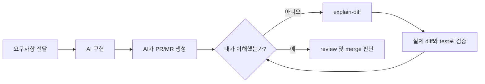
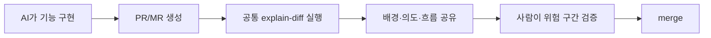
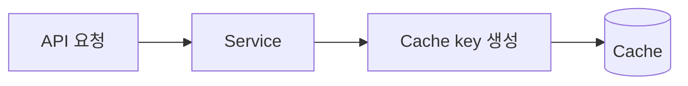

---
categories:
  - Git
  - AI
tags:
  - git
  - pull-request
  - merge-request
  - agent-skill
  - explain-diff
mermaid: true
source_item: 잘 사용하고 있는 pr, mr때의 explain-diff
image: assets/img/260929_code_review.png
---
> AI가 코드를 수정하는 단위가 달라졌다. `explain-diff`를 팀의 공통 규칙으로 만들어, 빠르게 만들어진 코드를 이해하지 못한 채 넘기면서 쌓이는 기술 부채를 줄여보자.
---

# 개요

코덱스나 클로드같은 코딩 에이전트를 쓰면 기능 구현부터 test, commit, PR(Pull Request)이나 MR(Merge Request) 생성까지 편하고 빠르게 끝난다. 예전 같으면 몇 시간 동안 직접 작성했을 변경이 몇 분 만에 올라오기도 한다.

이게.. 편하긴 한데 내가 코드를 점검하고(되돌아보고) 이해하는 속도보다 코드가 만들어지는 속도가 훨씬 빠르다. 
이전에는 개발자가 함수 하나, 모듈 하나를 직접 고치며 변경의 맥락을 자연스럽게 익혔다. 
그러나 이제는 AI에 한 번 자연어로 요청해서 API, service, DB schema, test와 문서까지 가로질러 수정한다. 코드를 작성하는 단위 자체가 달라졌다.

에이전트가 "구현을 완료했고 test도 통과했다"고 말하면 그럴듯해서 그대로 merge하고 싶어진다. 하지만 AI가 작성했다는 이유로 코드의 동작과 책임까지 AI에게 넘어가는 것은 아니다. **장애가 나면 원인을 찾아야 하는 사람도 나, 다른 팀원에게 설계를 설명해야 하는 사람도 나다....** 

그래서 AI가 만든 PR/MR일수록 GitHub의 `Files changed`나 GitLab의 `Changes` 화면에서 diff를 확인한다. 추가된 줄과 삭제된 줄을 따라가면 무엇이 바뀌었는지는 알 수 있지만 다음 질문에는 diff만으로 답하기 어렵다. (그리고 코드 변경이 몇백, 몇천줄이면 diff로는 볼 수가 없다.)

- AI는 왜 이 구현 방식을 선택했는가?
- 수정 전에는 요청과 데이터가 어떤 경로로 흘렀는가?
- 여러 파일의 변경이 하나의 동작으로 어떻게 연결되는가?
- AI가 건드리지 않았지만 함께 바뀌어야 하는 호출부는 없는가?
- test 통과와 별개로 내가 확인해야 할 위험은 무엇인가?

AI가 한 번에 바꿔버린 많은 코드를 좀 더 쉽게 파악하고 이해하기 위해 Geoffrey Litt가 공개한 [`explain-diff`](https://gist.github.com/geoffreylitt/a29df1b5f9865506e8952488eac3d524) agent skill을 도입했다.

이 스킬은 diff를 짧게 요약하고 개발한 배경과 핵심 아이디어, 코드 변경 흐름, 퀴즈까지 포함한 설명 자료를 만들게 한다.

# Josh 뉴스레터에서 발견한 같은 고민

`explain-diff`를 처음 알게 된 것은 내가 구독하고 있는 Josh의 뉴스레터에서 [`에이전트가 코딩하는 시대, 검증은 넘겨도 이해는 못 넘깁니다`](https://maily.so/josh/posts/e9o0y9per8w)라는 글을 읽으면서였다.

나도 AI에게 기능 구현과 수정을 맡기며 비슷한 갈증을 느끼고 있었다. 결과가 나오는 속도는 빨라졌지만 내가 그 코드를 온전히 이해하고 있는지 자신 있게 말하기 어려웠다. 게다가 나뿐 아니라 다른 팀원들까지 AI로 빠르게, 많은 내용들을 바꾸며 pull request를 날리는데 이를 따라가며 레포를 관리하기 버거웠다. 그렇다고 AI를 쓰기 전의 개발 방식으로 돌아가 모든 줄을 처음부터 직접 작성하고 읽는 것도 현실적인 답은 아니었다.

나만 이런 고민하는게 아닐텐데.. 라고 생각하며 힘들어하던 와중 이 글을 찾았다. 이들은 AI를 덜 사용하는 대신 AI가 만든 코드를 사람이 더 잘 이해하도록 돕는 방법을 고민하고 있었다.

여기서 바로 적용해볼 수 있는 방법으로 `explain-diff`가 있다. AI가 만든 변경을 날것의 diff로 넘겨받는 대신, 배경부터 직관과 코드 흐름까지 가르쳐주는 자료로 다시 만들고 **정말 이해했는지 퀴즈로 확인**한다. 나는 이 방법을 PR/MR 확인 과정에 적용했다. 나아가 팀이 함께 사용할 규칙으로 만들면 서로의 AI가 만든 변경도 같은 기준으로 확인할 수 있겠다고 생각했다.
(왜냐하면 우리 팀의 다른 개발자들도 본인들의 AI가 작성해준 코드에 대한 이해도가 낮을 것이므로..)

# AI가 만든 코드에 설명 과정이 필요한 이유

내가 직접 코드를 작성할 때는 요구사항을 고민하고, 관련 함수를 찾고, 실패도 해보고, test를 고치는 과정에서 시스템을 이해하게 된다. 반면 코딩 에이전트에게 작업을 맡기면 그 중간 과정이 압축된다.



생산성은 높아졌지만, 중간 과정을 생략한 만큼 `이 코드를 왜 이렇게 만들었는가`라는 맥락도 함께 사라진다. PR description에 구현 결과가 적혀 있어도 대체로 작업 완료 보고에 가깝다. 내가 개발했지만 설명할 수 없는 코드가 돼버린다.
(또한 내 경험상 description은 **AI가 만든 티가 팍팍**나며 **핵심 단어**에서 영어 번역체의 느낌까지 있어 한 눈에 잘 안들어온다.)

특히 다음 상황은 위험하다.

- test가 통과했다는 말만 믿고 어떤 동작을 test했는지 확인하지 않은 경우
- 익숙하지 않은 library나 pattern을 AI가 선택한 경우
- 한 요구사항을 처리하면서 API, DB, cache 등 여러 계층을 함께 수정한 경우
- 기존 호환성이나 장애 시 rollback 방법을 모르는 상태로 merge하는 경우
- 코드 양이 많아 diff를 대충 훑고 넘어가게 되는 경우

`explain-diff`의 목적은 내가 구현 과정을 따라잡고, merge 전에 질문할 지점을 찾는 것이다. 설명을 읽고도 핵심 동작을 말할 수 없다면 아직 이 코드는 main branch에 merge될 준비가 되지 않은 것이다. (이해 못한 채 그냥 넘어가는 PR/MR이 쌓이면 그것들이 곧 기술부채다.)

# 변경 단위가 커진 만큼 이해하려면 규칙이 필요하다

AI가 없던 때에도 팀원의 코드를 전부 이해하는 것은 불가능했다. 모든 PR의 모든 줄을 똑같은 깊이로 읽는 것도 현실적이지 않다. AI가 만드는 변경량까지 늘어나면 단순히 "리뷰를 더 꼼꼼히 하자"는 말로는 해결할 수 없다.



팀 저장소에 `explain-diff`를 skill로 만들어두면 누가 어떤 AI 도구를 사용하더라도 비슷한 형식의 설명을 요청할 수 있다. 매번 프롬프트를 새로 고민할 필요도 없고, 작성자와 리뷰어가 기대하는 결과물도 맞출 수 있다. 중요한 변경은 설명 문서를 PR/MR에 함께 연결하는 것을 팀 규칙으로 만들 수도 있다.

# 기술 부채는 이해하지 못한 merge에서도 생긴다

기술 부채라고 하면 흔히 중복 코드, 오래된 library, 부족한 test를 떠올린다. 
**하지만** 팀이 이유와 동작을 모르는 코드도 부채다. 
(Josh의 뉴스레터에서는 이를 개발자와 팀의 머릿속에 쌓이는 `인지 부채(cognitive debt)`라는 표현으로 설명한다. 코드는 동작하지만 사람의 이해가 그 속도를 따라가지 못해 프로젝트에 능동적으로 참여하기 어려워진 상태다.)

인지 부채와 코드에 남는 기술 부채는 따로 떨어져 있지 않다. 현재 구조를 이해하지 못하면 다음 변경에서 적절한 경계를 지키기 어렵고, 왜 존재하는지 모르는 로직을 우회하거나 중복 구현하기 쉽다. **사람의 머릿속에 먼저 쌓인 이해의 공백이 결국 코드의 복잡도와 유지보수 비용으로 옮겨간다.**

AI가 만든 코드가 정상 동작하더라도 다음 사람이 구조를 이해하지 못하면 작은 수정에도 다시 AI에게 넓은 범위의 변경을 맡기게 된다. 그 변경을 또 충분히 이해하지 않고 merge하면 **코드의 양은 늘지만 팀 안에 남는 지식은 줄어든다.**

```text
빠른 AI 구현
  → 이해하지 못한 merge
  → 수정이 두려운 코드
  → 다시 AI에게 큰 수정 위임
  → 더 커진 이해의 공백
  => 코드는 多 지식은 少
```

이런 흐름이 반복되면 test가 통과하는 동안에는 문제가 없어 보인다. 그러나 장애 대응, 요구사항 변경, 담당자 교체 시점에 비용이 한꺼번에 드러난다.

`explain-diff`는 모든 기술 부채를 해결하지 않는다. 다만 merge 직전에 변경의 배경과 핵심 contract를 사람이 다시 학습하게 만든다. **AI가 생산한 코드와 팀이 실제로 이해하는 코드 사이의 간격을 줄이는 것이다.**

# `explain-diff`는 무엇인가?

**`explain-diff`는 별도의 Git 명령어나 실행 프로그램이 아니다**. 코딩 에이전트가 특정 작업을 일관된 절차와 형식으로 수행하게 만드는 `SKILL.md`, 즉 재사용 가능한 작업 지침이다.

원본 Gist에는 두 가지 버전이 있다.

- `explain-diff-html`: CSS와 JavaScript를 포함한 독립적인 HTML 문서를 만든다.
- `explain-diff-notion`: Notion MCP를 통해 같은 내용을 Notion 페이지로 만든다.

내가 주로 쓰는 쪽은 HTML 버전이다. 생성 결과를 코드 저장소 밖의 `/tmp`에 두기 때문에 작업 중인 Git 상태를 더럽히지 않고, 브라우저에서 바로 열어볼 수 있다.

```text
/tmp/2026-09-09-explanation-auth-cache.html
```

HTML 한 파일 안에 스타일과 동작이 모두 포함되므로 별도의 웹 서버나 패키지 설치도 필요 없다. 목차를 눌러 이동하고, 다이어그램으로 흐름을 보고, 마지막에는 객관식 문제를 풀며 정말 이해했는지 확인할 수 있다.

 `explain-diff`는 결과물에 다음 네 영역을 반드시 포함하도록 요구한다.

## Background

변경과 관련된 기존 시스템부터 설명한다. 독자가 코드베이스나 기술 영역을 잘 모를 가능성을 고려해 초심자용 배경을 먼저 제공하고, 그다음 이번 변경에 직접 관련된 구조로 범위를 좁힌다.

중요한 점은 diff만 읽지 않고 주변 코드를 넓게 살펴보게 한다는 것이다. AI가 수정한 함수만 보면 구현이 자연스러워 보여도 호출부, 관련 모델과 설정, test까지 범위를 넓히면 빠진 변경이 보일 수 있다.

## Intuition

구현 상세에 들어가기 전에 변경의 핵심 아이디어를 작은 예제로 설명한다.

예를 들어 tenant별 cache key 분리가 목적이라면 곧바로 해시 함수 구현을 설명하지 않는다. 먼저 아래처럼 이전과 이후의 데이터가 어떻게 달라지는지 보여주는 식이다.

| 요청 | 기존 key | 변경 후 key |
|---|---|---|
| tenant A의 user 10 | `user:10` | `tenant:A:user:10` |
| tenant B의 user 10 | `user:10` | `tenant:B:user:10` |

이 표를 보면 기존 방식에서는 **충돌할 수 있었다는 사실을 이해할 수 있다**. 
그다음 코드를 보면 왜 함수 인자와 호출부가 함께 바뀌었는지가 자연스럽게 연결된다.

## Code

변경 파일을 알파벳순으로 나열하지 않고 이해하기 쉬운 흐름으로 묶어 설명한다.



가령 cache key 변경이라면 다음 순서가 될 수 있다.

1. 새로운 key 규칙
2. key 생성 함수의 변경
3. 호출부가 tenant 정보를 넘기도록 바뀐 부분
4. 기존 key와의 호환 또는 migration 처리
5. 테스트가 보장하는 동작

파일 중심이 아닌 실행 흐름 중심으로 설명하니 여러 디렉터리에 흩어진 변경도 하나의 이야기로 읽힌다.

## Quiz (하이라이트!!)

explain diff의 하이라이트이자 가장 중요한 마지막에는 변경 내용을 이해해야 풀 수 있는 중간 난이도의 객관식 문제 다섯 개를 만든다. 
-> 반응형이며 답을 선택하면 맞았는지와 그 이유를 바로 보여준다.

처음에는 코드 설명에 퀴즈까지 필요한가 싶었다. 그런데 `AI의 설명을 읽었다`와 `AI가 만든 동작을 내가 이해했다`는 다르다. 정답을 고르지 못했다면 설명이 부족했거나 내가 아직 변경을 인수받지 못한 것이다. 특히 생소한 도메인이나 복잡한 데이터 흐름에서는 문제를 풀어보는 과정이 내가 놓친 부분을 꽤 잘 드러낸다.

Geoffrey Litt는 에이전트가 작성한 코드에 관한 다섯 문제를 통과하지 못하면 동료에게 review를 요청하지 않는 것을 자신의 규칙으로 삼았다고 한다. 퀴즈는 재미를 위한 부록이 아니라 AI가 끌어올린 구현 속도를 내 이해의 속도에 맞추는 조절기인 셈이다. 나와 팀에 맞게 문제 수나 통과 기준은 바꿀 수 있지만, `읽었으니 이해했을 것`이라는 착각을 확인하는 단계는 남겨둘 가치가 있다.

---
# 사용 소감

물론 최종 판단은 여전히 사람이 실제 코드와 test를 보고 내려야 한다. `explain-diff`를 잘 쓰면 AI가 만든 코드를 무작정 신뢰하지 않으면서도 AI의 생산성을 활용할 수 있다. 개인에게는 내가 이해하지 못한 채 merge하는 일을 막는 장치이고, 팀에는 AI가 만든 큰 변경을 일정한 형식으로 설명하고 검토하기 위한 협업 규칙이다.

지금의 목표는 명확하다. AI가 빠르게 만든 결과를 내가 제대로 이해하고 검증한 뒤 넘기는 것, 그리고 이해하지 못한 코드가 쌓이며 기술 부채가 되는 일을 줄이는 것이다.

# 참고 자료

- [Geoffrey Litt의 explain-diff Gist](https://gist.github.com/geoffreylitt/a29df1b5f9865506e8952488eac3d524)
- [Josh 뉴스레터: 에이전트가 코딩하는 시대, 검증은 넘겨도 이해는 못 넘깁니다](https://maily.so/josh/posts/e9o0y9per8w)
